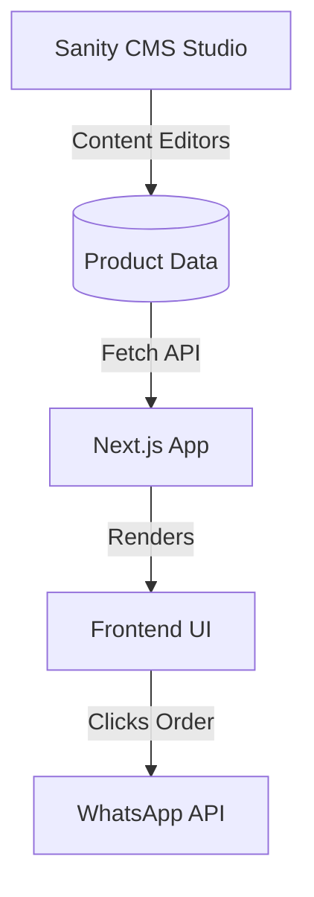

# Architecture

## Application Architecture
- **Framework**: Next.js App Router
- **Routing**: Single-page application approach using anchor links for navigation.
- **Styling**: Tailwind CSS with custom theme variables.

## Data Flow

## Component Architecture
- Reusable UI elements (Buttons, Cards, Section Headings).
- Client components only where necessary (filtering, interactive elements).
